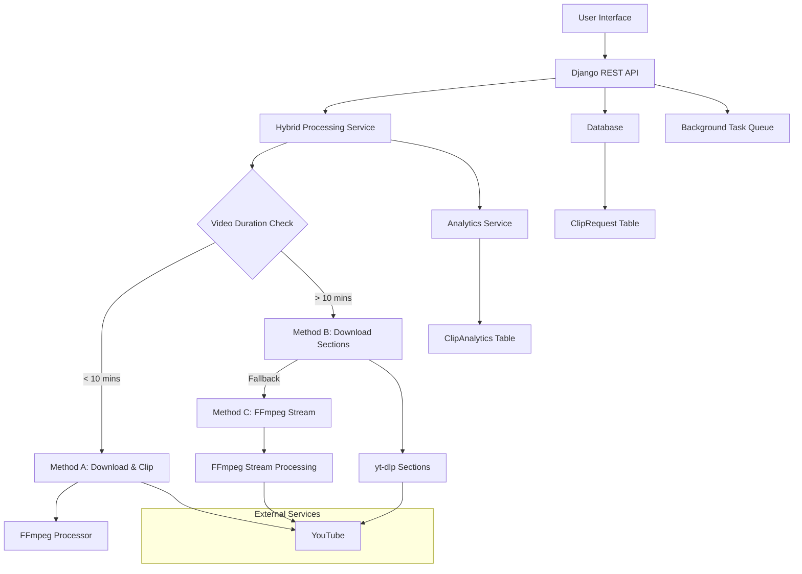

# Design Document

## Overview

The YouTube Clipper feature will be implemented as a Django web application that allows users to extract specific segments from YouTube videos. The system will use yt-dlp for video downloading and FFmpeg for video processing, providing a REST API and web interface for clip generation and download.

## Architecture

### High-Level Architecture



### Technology Stack

- **Backend Framework**: Django with Django REST Framework
- **Video Download**: yt-dlp (successor to youtube-dl)
- **Video Processing**: FFmpeg
- **Database**: SQLite (current setup) with option to upgrade to PostgreSQL
- **Background Processing**: Django-RQ or Celery for async processing
- **File Storage**: Local filesystem with option for cloud storage (S3)
- **Frontend**: Django templates with JavaScript for dynamic updates

## Components and Interfaces

### 1. Models

#### ClipRequest Model
```python
class ClipRequest(UUIDMixin):
    STATUS_CHOICES = [
        ('pending', 'Pending'),
        ('processing', 'Processing'),
        ('completed', 'Completed'),
        ('failed', 'Failed'),
    ]
    
    PROCESSING_METHOD_CHOICES = [
        ('download_and_clip', 'Download Full Video and Clip'),
        ('download_sections', 'Download Specific Sections'),
        ('ffmpeg_stream', 'FFmpeg Stream Processing'),
    ]
    
    youtube_url = models.URLField()
    start_time = models.IntegerField()  # in seconds
    end_time = models.IntegerField()    # in seconds
    status = models.CharField(max_length=20, choices=STATUS_CHOICES, default='pending')
    processed_at = models.DateTimeField(null=True, blank=True)
    file_path = models.CharField(max_length=500, null=True, blank=True)
    error_message = models.TextField(null=True, blank=True)
    original_title = models.CharField(max_length=200, null=True, blank=True)
    file_size = models.BigIntegerField(null=True, blank=True)
    video_duration = models.IntegerField(null=True, blank=True)  # total video duration in seconds
    channel_name = models.CharField(max_length=200, null=True, blank=True)
    channel_id = models.CharField(max_length=100, null=True, blank=True)
    processing_method = models.CharField(max_length=30, choices=PROCESSING_METHOD_CHOICES, null=True, blank=True)
    processing_log = models.JSONField(default=dict, blank=True)  # Stores detailed processing steps and errors
```

#### Analytics Model
```python
class ClipAnalytics(UUIDMixin):
    # Request Analytics
    clip_request = models.ForeignKey(ClipRequest, on_delete=models.CASCADE, related_name='analytics')
    
    # Video Analytics
    video_id = models.CharField(max_length=50)  # YouTube video ID
    video_duration = models.IntegerField()  # in seconds
    clip_duration = models.IntegerField()  # in seconds
    clip_percentage = models.FloatField()  # percentage of original video clipped
    
    # Processing Analytics
    processing_method = models.CharField(max_length=30)
    processing_time = models.FloatField(null=True, blank=True)  # in seconds
    download_size = models.BigIntegerField(null=True, blank=True)  # bytes downloaded
    final_file_size = models.BigIntegerField(null=True, blank=True)  # final clip size
    
    # Channel Analytics
    channel_name = models.CharField(max_length=200, null=True, blank=True)
    channel_id = models.CharField(max_length=100, null=True, blank=True)
    
    # User Behavior Analytics
    user_ip = models.GenericIPAddressField(null=True, blank=True)
    user_agent = models.TextField(null=True, blank=True)
    referrer = models.URLField(null=True, blank=True)
    
    # System Performance
    server_load = models.FloatField(null=True, blank=True)
    memory_usage = models.FloatField(null=True, blank=True)  # in MB
    
    # Success/Failure Analytics
    success = models.BooleanField(default=False)
    error_type = models.CharField(max_length=100, null=True, blank=True)
    retry_count = models.IntegerField(default=0)
```

### 2. Services

#### HybridProcessingService
```python
class HybridProcessingService:
    def processClipRequest(self, clipRequest: ClipRequest) -> bool
    def determineProcessingMethod(self, videoDuration: int) -> str
    def methodA_downloadAndClip(self, clipRequest: ClipRequest) -> bool  # < 10 mins
    def methodB_downloadSections(self, clipRequest: ClipRequest) -> bool  # > 10 mins
    def methodC_ffmpegStream(self, clipRequest: ClipRequest) -> bool  # fallback
    def logProcessingStep(self, clipRequest: ClipRequest, step: str, status: str, details: dict) -> None
```

#### VideoInfoService
```python
class VideoInfoService:
    def validateYoutubeUrl(self, url: str) -> bool
    def getVideoInfo(self, url: str) -> dict  # includes duration, title, channel info
    def extractVideoId(self, url: str) -> str
    def getChannelInfo(self, url: str) -> dict
```

#### AnalyticsService
```python
class AnalyticsService:
    def recordClipRequest(self, clipRequest: ClipRequest, userInfo: dict) -> ClipAnalytics
    def updateProcessingMetrics(self, analytics: ClipAnalytics, processingData: dict) -> None
    def recordSuccess(self, analytics: ClipAnalytics, finalFileSize: int) -> None
    def recordFailure(self, analytics: ClipAnalytics, errorType: str) -> None
    def getPopularChannels(self, days: int = 30) -> list
    def getProcessingMethodStats(self) -> dict
```

#### ClipRequestService
```python
class ClipRequestService:
    def createClipRequest(self, youtubeUrl: str, startTime: str, endTime: str) -> ClipRequest
    def getClipStatus(self, requestId: str) -> dict
    def cleanupOldFiles(self) -> None
    def updateProcessingLog(self, clipRequest: ClipRequest, logEntry: dict) -> None
```

### 3. API Endpoints

#### REST API Endpoints
```
POST /api/clips/create/
- Creates a new clip request
- Input: {youtubeUrl, startTime, endTime}
- Output: {requestId, status}

GET /api/clips/{requestId}/status/
- Gets the current status of a clip request
- Output: {status, progress, errorMessage}

GET /api/clips/{requestId}/download/
- Downloads the processed clip file
- Output: File download response

POST /api/clips/validate-url/
- Validates YouTube URL and returns video info
- Input: {youtubeUrl}
- Output: {valid, title, duration, thumbnail}
```

#### ViewSet Classes
```python
class ClipRequestViewSet(viewsets.ModelViewSet):
    queryset = ClipRequest.objects.all()
    serializer_class = ClipRequestSerializer
    # Following the established pattern with proper error handling,
    # logging, and transaction management
    
class ValidateUrlViewSet(viewsets.ViewSet):
    # Custom viewset for URL validation endpoint
```

### 4. Background Processing

#### Task Queue Integration
- Use Django-RQ for background processing of clip requests
- Separate worker processes to handle video downloading and processing
- Progress tracking and status updates

#### Hybrid Processing Pipeline
1. **Validation Phase**: Validate URL and timestamps
2. **Video Info Phase**: Get video duration and channel information
3. **Method Selection Phase**: Choose processing method based on video duration
4. **Processing Phase**: Execute selected method with fallback options
   - **Method A** (< 10 mins): Download full video → Clip with FFmpeg
   - **Method B** (> 10 mins): Use yt-dlp --download-sections
   - **Method C** (Fallback): FFmpeg stream processing with direct URL
5. **Analytics Phase**: Record processing metrics and user behavior
6. **Cleanup Phase**: Remove temporary files

#### Processing Method Details

**Method A: Download and Clip (< 10 minutes)**
```python
def methodA_downloadAndClip(self, clipRequest):
    # 1. Download full video using yt-dlp
    # 2. Use FFmpeg to clip the specific segment
    # 3. Log: download_size, processing_time
    # 4. Most reliable but uses more bandwidth/storage
```

**Method B: Download Sections (> 10 minutes)**
```python
def methodB_downloadSections(self, clipRequest):
    # 1. Use yt-dlp with --download-sections flag
    # 2. Download only the required segment
    # 3. Log: section_download_success, file_size
    # 4. Efficient for long videos
```

**Method C: FFmpeg Stream (Fallback)**
```python
def methodC_ffmpegStream(self, clipRequest):
    # 1. Get direct streaming URL from yt-dlp
    # 2. Use FFmpeg to seek and download only clip segment
    # 3. Server-side seeking reduces download size
    # 4. Used when Method B fails
```

## Data Models

### Database Schema

```sql
-- ClipRequest table (inheriting from UUIDMixin)
CREATE TABLE clip_request (
    id UUID PRIMARY KEY,
    youtube_url VARCHAR(500) NOT NULL,
    start_time INTEGER NOT NULL,
    end_time INTEGER NOT NULL,
    status VARCHAR(20) DEFAULT 'pending',
    created_at TIMESTAMP DEFAULT CURRENT_TIMESTAMP,
    updated_at TIMESTAMP DEFAULT CURRENT_TIMESTAMP,
    processed_at TIMESTAMP NULL,
    file_path VARCHAR(500) NULL,
    error_message TEXT NULL,
    original_title VARCHAR(200) NULL,
    file_size BIGINT NULL,
    video_duration INTEGER NULL,
    channel_name VARCHAR(200) NULL,
    channel_id VARCHAR(100) NULL,
    processing_method VARCHAR(30) NULL,
    processing_log JSONB DEFAULT '{}'
);

-- ClipAnalytics table
CREATE TABLE clip_analytics (
    id UUID PRIMARY KEY,
    created_at TIMESTAMP DEFAULT CURRENT_TIMESTAMP,
    updated_at TIMESTAMP DEFAULT CURRENT_TIMESTAMP,
    clip_request_id UUID REFERENCES clip_request(id) ON DELETE CASCADE,
    video_id VARCHAR(50) NOT NULL,
    video_duration INTEGER NOT NULL,
    clip_duration INTEGER NOT NULL,
    clip_percentage FLOAT NOT NULL,
    processing_method VARCHAR(30) NOT NULL,
    processing_time FLOAT NULL,
    download_size BIGINT NULL,
    final_file_size BIGINT NULL,
    channel_name VARCHAR(200) NULL,
    channel_id VARCHAR(100) NULL,
    user_ip INET NULL,
    user_agent TEXT NULL,
    referrer VARCHAR(500) NULL,
    server_load FLOAT NULL,
    memory_usage FLOAT NULL,
    success BOOLEAN DEFAULT FALSE,
    error_type VARCHAR(100) NULL,
    retry_count INTEGER DEFAULT 0
);

-- Indexes for efficient querying
CREATE INDEX idx_clip_request_status ON clip_request(status);
CREATE INDEX idx_clip_request_created_at ON clip_request(created_at);
CREATE INDEX idx_clip_request_channel_id ON clip_request(channel_id);
CREATE INDEX idx_clip_analytics_video_id ON clip_analytics(video_id);
CREATE INDEX idx_clip_analytics_channel_id ON clip_analytics(channel_id);
CREATE INDEX idx_clip_analytics_processing_method ON clip_analytics(processing_method);
CREATE INDEX idx_clip_analytics_success ON clip_analytics(success);
CREATE INDEX idx_clip_analytics_created_at ON clip_analytics(created_at);
```

### File Storage Structure
```
media/
├── clips/
│   ├── {requestId}/
│   │   ├── originalSegment.mp4
│   │   └── processedClip.mp4
└── temp/
    └── {requestId}/
        └── tempFiles...
```

### Serializer Classes
```python
class ClipRequestSerializer(FieldMixin):
    class Meta:
        model = ClipRequest
        fields = '__all__'
        # Will inherit field exclusion capabilities from FieldMixin
```

## Error Handling

### Error Categories

1. **Input Validation Errors**
   - Invalid YouTube URL format
   - Invalid timestamp format
   - End time before start time
   - Timestamp exceeds video duration

2. **Video Access Errors**
   - Private or unavailable videos
   - Age-restricted content
   - Geographic restrictions
   - Copyright-protected content

3. **Processing Errors**
   - Download failures
   - FFmpeg processing errors
   - Insufficient disk space
   - Network connectivity issues

4. **System Errors**
   - Database connection issues
   - File system permissions
   - Resource exhaustion

### Error Response Format
```json
{
    "error": "End time must be after start time",
    "errorCode": "INVALID_TIMESTAMP",
    "details": {
        "startTime": "3:30",
        "endTime": "2:45"
    }
}
```

### Implementation Standards
- All models inherit from UUIDMixin for consistent UUID primary keys
- All serializers inherit from FieldMixin for field exclusion capabilities
- ViewSet classes follow naming convention: "ClipRequestViewSet"
- Variable names use camelCase: youtubeUrl, startTime, endTime
- Use runSerializer function for object creation and updates
- Use logger for activity logging and error tracking
- Follow established error handling patterns with try-catch blocks
- Use @transaction.atomic for data consistency
- Implement proper queryset optimization with select_related and prefetch_related

### Retry Logic
- Automatic retry for transient network errors (max 3 attempts)
- Exponential backoff for rate limiting
- Manual retry option for failed requests

## Testing Strategy

### Unit Tests
- Model validation and business logic
- Service layer functionality
- Utility functions (timestamp parsing, URL validation)
- Error handling scenarios

### Integration Tests
- API endpoint functionality
- Database operations
- File system operations
- Background task processing

### End-to-End Tests
- Complete clip creation workflow
- File download functionality
- Error scenarios and recovery
- Performance under load

### Test Data Strategy
- Mock YouTube responses for consistent testing
- Sample video files for processing tests
- Edge case scenarios (very short clips, long videos)

### Performance Testing
- Concurrent request handling
- Large file processing
- Memory usage optimization
- Response time benchmarks

## Security Considerations

### Input Validation
- Strict URL validation to prevent SSRF attacks
- Timestamp range validation
- File path sanitization
- Rate limiting per IP address

### File Security
- Secure file storage with proper permissions
- Automatic cleanup of temporary files
- File size limits to prevent disk exhaustion
- Virus scanning for downloaded content (optional)

### API Security
- CSRF protection for web forms
- Input sanitization and validation
- Proper error messages without information leakage
- Request logging and monitoring

## Performance Optimization

### Caching Strategy
- Cache video metadata for frequently requested videos
- Cache processed clips for identical requests
- Redis integration for session and cache storage

### Resource Management
- Disk space monitoring and cleanup
- Memory usage optimization during processing
- CPU usage limits for FFmpeg operations
- Connection pooling for database operations

### Scalability Considerations
- Horizontal scaling with multiple worker processes
- Load balancing for API requests
- Database optimization with proper indexing
- CDN integration for file delivery